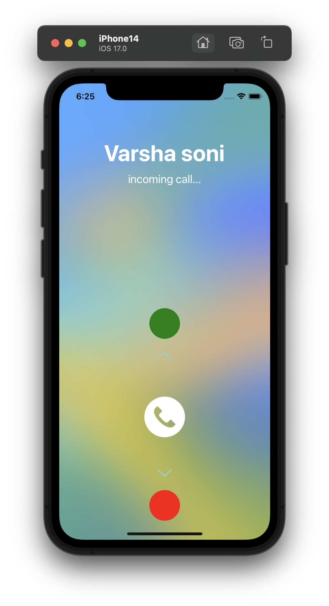
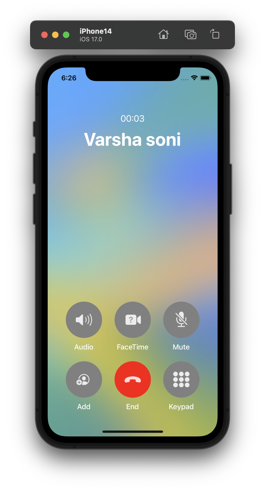
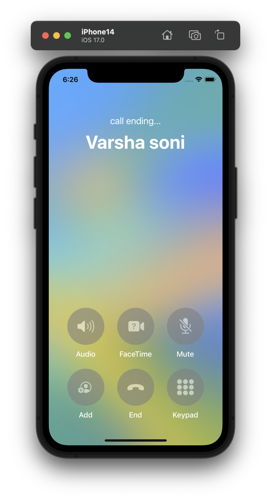
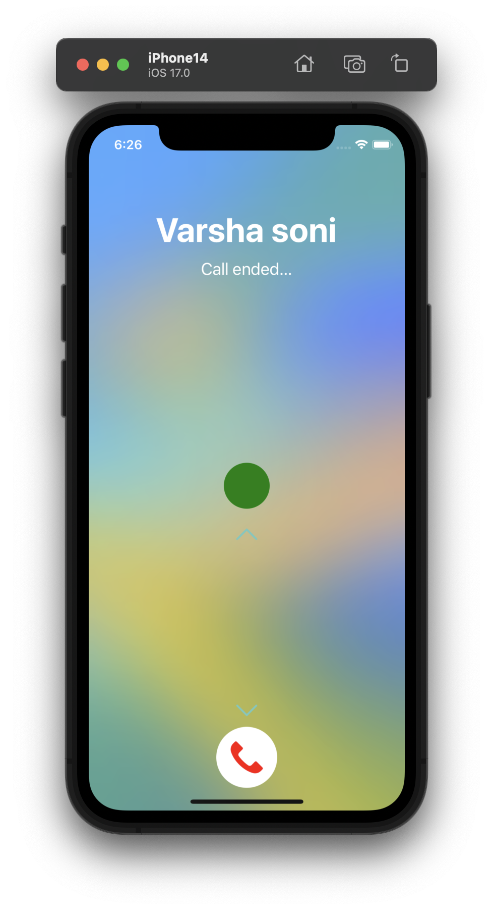

# CallUI - React Native Calling View Animation

CallUI is a React Native application designed to showcase the power and versatility of the React Native Animation framework. With a focus on creating a seamless and visually appealing user interface for incoming calls, CallUI incorporates various animation techniques such as sequence, loop, and timing animations.


|  |  |
| ------------------------------------------------------------ | ------------------------------------------------------------ |
|  |  |


## Features

- **Incoming Call Interface:** Enjoy a beautifully crafted UI for handling incoming calls, complete with smooth animations for an engaging user experience.
- **Decline Call Animation:** The app provides an intuitive and visually pleasing animation for declining incoming calls.
- **Call Timing Display:** Utilizing timers, CallUI dynamically displays the call duration, keeping users informed about the elapsed time during the call.
- **System Blur Effect:** Enhance the visual aesthetics with the integration of the React Native Community Blur library, creating a sleek and modern system blur for a polished look.

## Animation Techniques

- **Sequence Animation:** Explore the seamless flow of animations with carefully choreographed sequences that enhance the overall user interface.
- **Loop Animation:** Integrate looping animations to create dynamic and captivating effects, ensuring a visually engaging experience.
- **Timing Animation:** Leverage timing animations to synchronize and display real-time information, such as call duration, providing users with valuable feedback.

## Getting Started

1. **Clone the Repository:**

   ```bash
   git clone https://github.com/DevVarsha/CallUI.git
   cd callUi
   ```

2. **Install Dependencies:**

   ```bash
   yarn 
   cd ios
   pod install
   ```

3. **Run the Application:**

   ```
   eyarn android
   # or
   yarn ios
   ```

## Requirements

- Node.js
- npm or yarn
- React Native CLI

## Libraries Used

- [React Native Animation](https://reactnative.dev/docs/animations)
- [React Native Community Blur](https://github.com/react-native-community/react-native-blur)

## Contributing

Feel free to contribute to the project by submitting bug reports, feature requests, or even pull requests. Your feedback is valuable in enhancing the quality and functionality of CallUI.

## License

This project is licensed under the MIT License, allowing you to modify and distribute the app as per your requirements.

```
MIT License

Copyright (c) 2023 Varsha Soni

Permission is hereby granted, free of charge, to any person obtaining a copy
of this software and associated documentation files (the "Software"), to deal
in the Software without restriction, including without limitation the rights
to use, copy, modify, merge, publish, distribute, sublicense, and/or sell
copies of the Software, and to permit persons to whom the Software is
furnished to do so, subject to the following conditions:

The above copyright notice and this permission notice shall be included in
all copies or substantial portions of the Software.

THE SOFTWARE IS PROVIDED "AS IS", WITHOUT WARRANTY OF ANY KIND, EXPRESS OR
IMPLIED, INCLUDING BUT NOT LIMITED TO THE WARRANTIES OF MERCHANTABILITY,
FITNESS FOR A PARTICULAR PURPOSE AND NONINFRINGEMENT. IN NO EVENT SHALL THE
AUTHORS OR COPYRIGHT HOLDERS BE LIABLE FOR ANY CLAIM, DAMAGES OR OTHER
LIABILITY, WHETHER IN AN ACTION OF CONTRACT, TORT OR OTHERWISE, ARISING FROM,
OUT OF OR IN CONNECTION WITH THE SOFTWARE OR THE USE OR OTHER DEALINGS IN
THE SOFTWARE.
```

